# 当前项目整体审计

日期：2026-07-13

## 审计范围

- 主工作区 `master` 的桌面与 390×844 手机视口。
- 从 AI 配置、提问、六次投掷到结果各标签页的完整路径。
- 未合并工作树 `codex/physical-toss-trust-boundary` 的构建与关键画面对比。
- 构建、测试、仓库状态、模块规模和运行时警告。

用户目标：自然进入一次可信、有仪式感、可理解的三枚铜钱六爻起卦，并在 AI 不可用时仍获得完整传统结果。

总体结论：当前项目处于“多条重做路线叠加后的失焦状态”。领域逻辑和物理可信链路有价值，但主流程、视觉实现和代码边界没有形成同一套产品。建议停止继续局部打磨，以一个明确的核心体验为轴做收敛式重构。

## 流程健康度

1. **AI 配置入口 — 严重**
   - 首次进入即被 Provider、URL、Key、模型阻断。
   - 这与 2026-07-06 设计文档中“传统结果可先完成，AI 可之后补配”的约定冲突。
   - 普通用户在理解产品价值前就要处理开发者配置，信任和转化都会流失。

   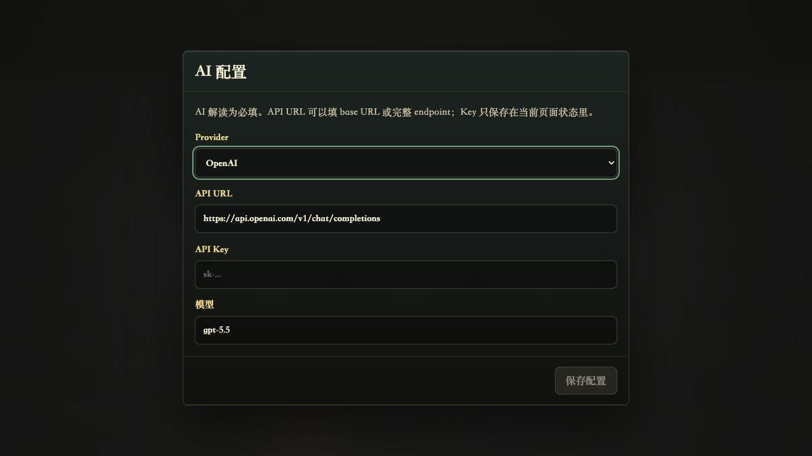

2. **问题输入 — 一般**
   - 快捷问题降低输入负担，主按钮状态明确。
   - 页面只是通用模态框，没有解释提问方式、起卦过程或隐私边界；视觉上也没有把用户带入仪式。

   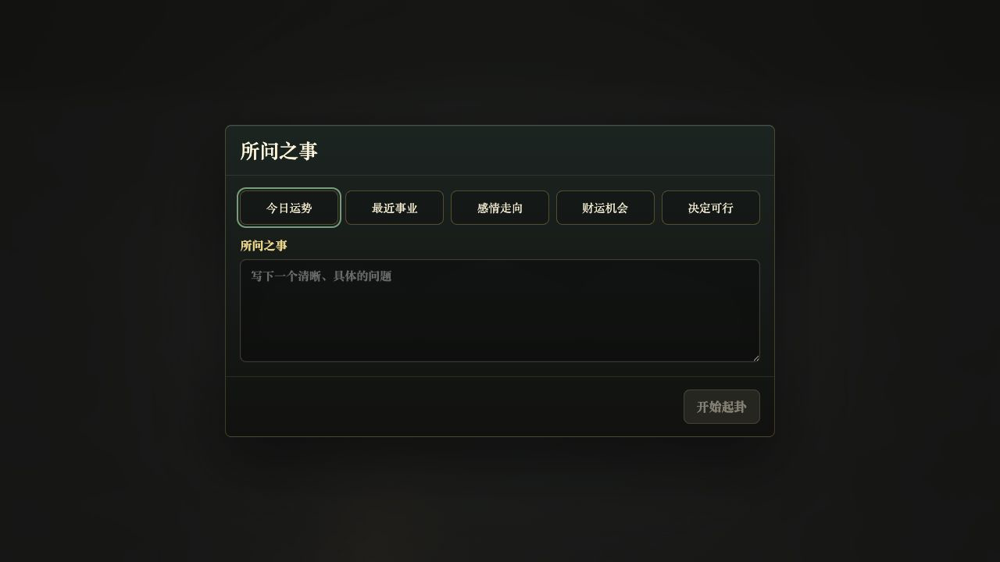

3. **起卦入口 — 严重**
   - 开始后再次出现摄像头/桌面投掷选择，形成第二层权限与模式决策。
   - 当前默认流程与后期“PC 钱筒、移动端摇晃、权限失败不阻断”的设计方向不一致。
   - 中央铜钱严重过曝，纹理与正反面不可辨，核心价值在第一帧就失效。

   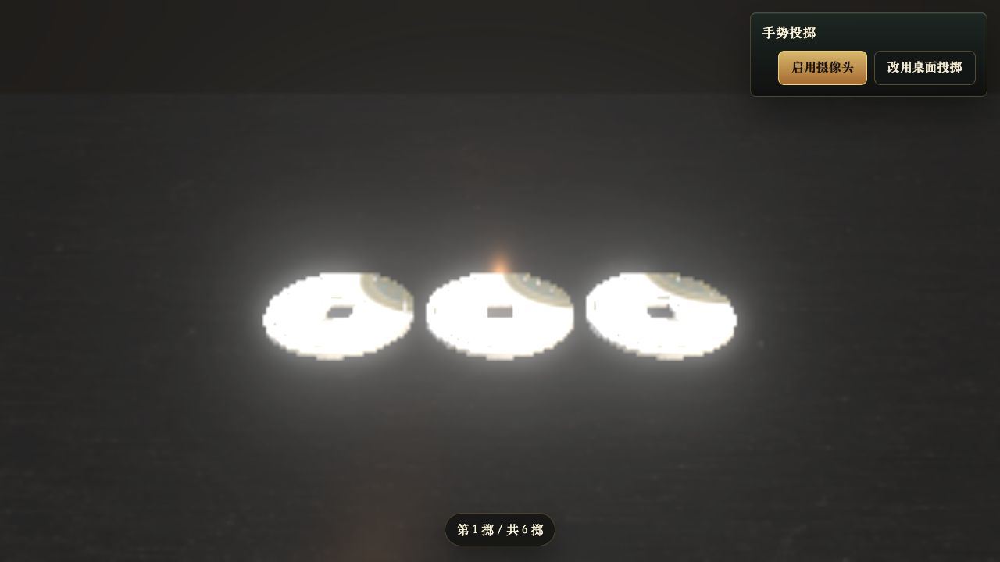

4. **单次投掷与落定 — 严重**
   - 实测第一次落定约 8 秒，六次投掷仅等待就接近 48 秒。
   - 落定后仍然过曝，用户无法从视觉上确认结果来自真实朝向。
   - 进度只有“第 N 掷”，缺少本次得到哪一爻、为什么、下一步做什么的及时反馈。

   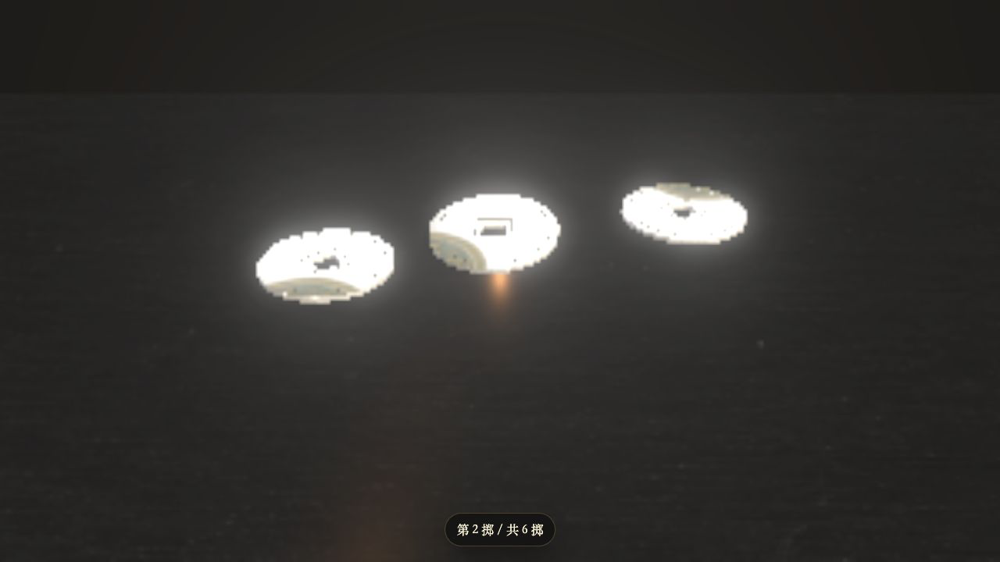

5. **AI 结果失败态 — 较差**
   - AI 失败后传统结果仍保留，这是正确的容错方向。
   - 但默认标签和页面标题仍是“AI 解读”，用户完成漫长起卦后首先看到的是失败，而不是卦象。
   - `Failed to fetch` 是技术错误，不是可行动的用户文案。

   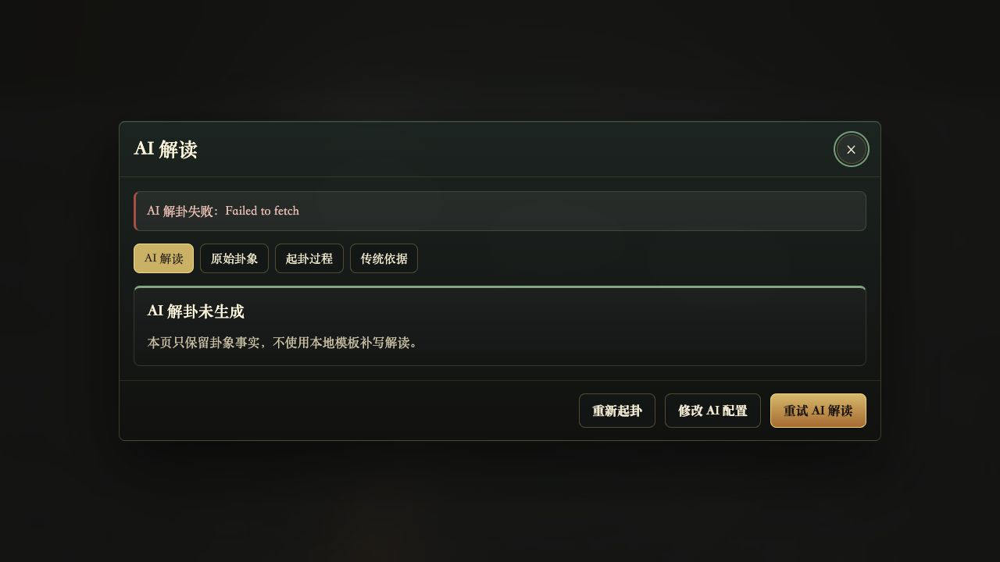

6. **原始卦象 — 一般**
   - 本卦、变卦、动爻和六爻图能形成基本闭环。
   - 页面标题仍是“AI 解读”，信息层级与当前标签不一致；问题、本卦、变卦、动爻四张同权卡片也没有突出主结论。

   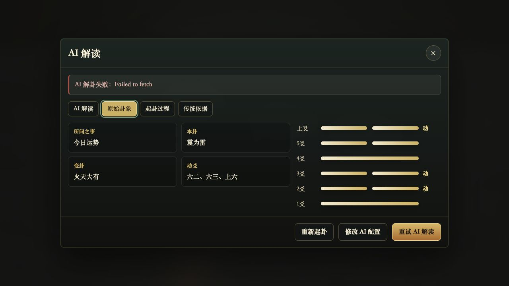

7. **起卦过程 — 较差**
   - 数据可追溯，但只是六行文本，没有把三枚铜钱、分数、爻型和动爻关系组织成可扫读的记录。
   - 未展示已经在设计中定义的输入来源、落定原因和物理证据。

   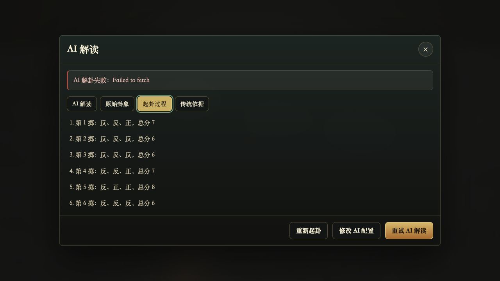

8. **传统依据 — 一般**
   - 经典原文完整保留，内容可信度基础较好。
   - 缺少卦辞、象辞、动爻、变卦的分组、释义和与当前问题的关联说明，阅读成本高。

   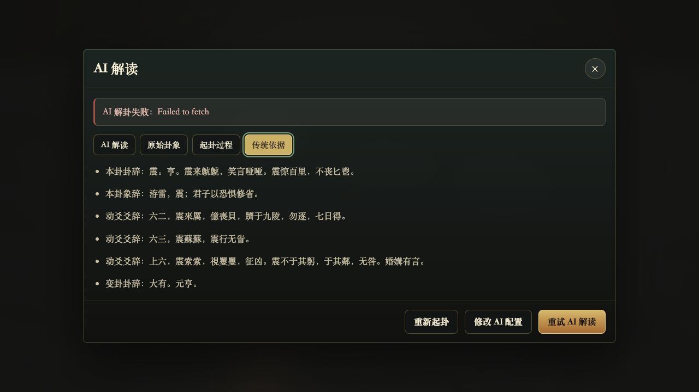

9. **手机流程 — 严重**
   - 表单采用底部面板和单列快捷问题，触控尺寸基本可用。
   - 铜钱在 390px 宽度下被左右裁切且仍然过曝；摄像头选择面板占据底部主要操作区。
   - 当前浏览器环境无法验证真实 `DeviceMotionEvent` 权限与传感器质量，移动端摇晃仍需真机测试。

   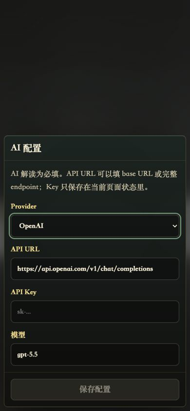
   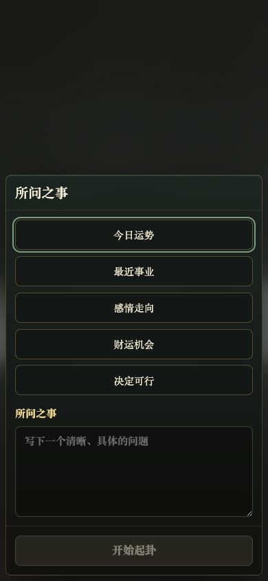
   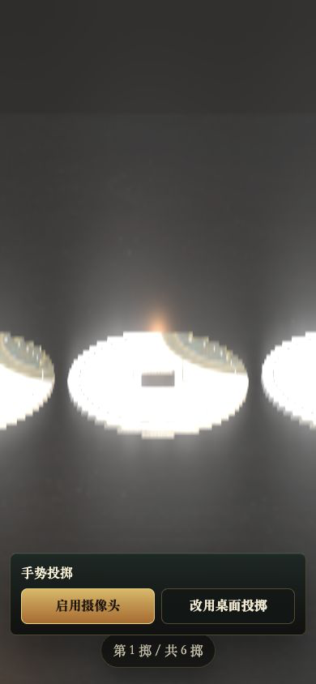

## 值得保留的资产

- `domain/`、`data/` 的三枚铜钱计分、64 卦映射、动爻与变卦逻辑，已有较完整测试。
- AI 失败不抹掉传统结果，结果标签支持键盘方向键，模态框有焦点陷阱和焦点恢复。
- 未合并工作树中的物理证据、落定原因、输入摘要和最终刚体朝向读取，是可信起卦的正确底层边界。
- 未合并工作树的桌面、铜钱材质与克制 HUD 明显优于主工作区，可作为视觉基线。

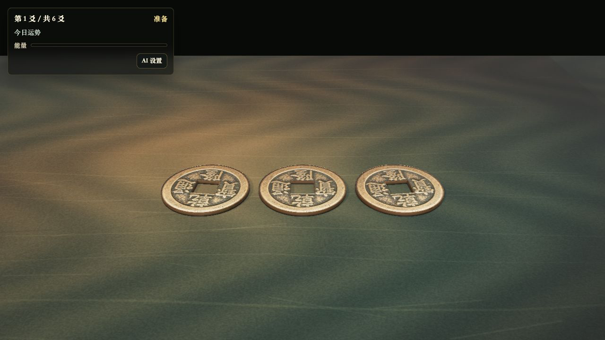

## 结构与工程风险

### 严重

- 主工作区生产构建失败：`window.__tabletop` 缺少类型声明，`RGBELoader` 未定义。
- 主工作区有 12 个已修改源文件、546 行新增和 217 行删除，另有多组调试脚本、PBR 素材和渲染文件未提交。
- 同时存在一个大幅演进但也未提交干净的工作树；两条路线都在修改 `App`、`TabletopScene`、物理与样式，合并风险高。
- `TabletopScene.tsx` 在主工作区为 1543 行，在未合并分支增至 1950 行；`styles.css` 分别为 1024 和 1362 行。渲染、资产加载、材质、输入、动画、调试和可访问性交织在一个组件中。

### 高

- 主工作区运行时连续输出大量 Three.js 材质参数为 `undefined` 的警告，说明材质工厂边界不干净。
- 未合并分支虽能构建，但主 JS 为 3.02 MB（gzip 1.03 MB），铜钱纹理 3.39 MB，Rapier WASM 1.44 MB；无按需加载。
- 测试命令会扫描仓库内 `.worktrees`，因此一次运行同时执行主工作区和工作树测试：56 个文件、384 个测试、约 52 秒。结果通过，但不能清晰说明当前分支本身是否健康。
- 缺少 README、产品边界说明、启动/部署说明和一套被认可的验收截图；现有多份设计文档彼此已有冲突。

## 可访问性观察

已确认的优点：模态框有语义标题、焦点管理和 Escape 行为；结果标签使用标准 tab 语义；核心桌面区域有键盘可触发按钮。

可见风险：暗色界面中的占位文字、禁用按钮和次要文案对比度偏低；整屏透明点击面没有可见操作提示；手机画面中的铜钱被裁切；摄像头选择在起卦后突然出现，状态变化对认知障碍用户不友好。截图无法确认完整 WCAG 符合性，仍需键盘全流程、200% 缩放、屏幕阅读器、减少动态效果和真机权限测试。

## 建议的整改顺序

1. 先锁定产品主张和默认路径，明确 AI、摄像头、摇晃和桌面投掷谁是核心、谁是增强。
2. 选定一个代码基线，停止主工作区与工作树双线演进；保留领域逻辑、物理证据和分支视觉资产。
3. 重建最小垂直切片：提问 → 一次投掷 → 即时爻反馈 → 六次成卦 → 传统结果；AI 完全后置。
4. 将场景拆成渲染器、资产、材质、输入、物理同步、HUD 六个边界，并把状态机作为唯一流程来源。
5. 视觉基线通过后再恢复摄像头、传感器、AI、多 Provider 和高级后处理。
6. 最后处理按需加载、真机性能、可访问性和部署文档。

## 证据限制

- AI 成功态未用真实外部 API 测试；审计只验证了安全的本地失败路径。
- 摄像头权限未授予，未审计真实手势识别质量。
- `DeviceMotionEvent`、陀螺仪和移动 GPU 性能需要真机验证。
- 截图能支持视觉、层级和可见交互判断，不能单独证明完整可访问性、物理公平性或统计分布。
